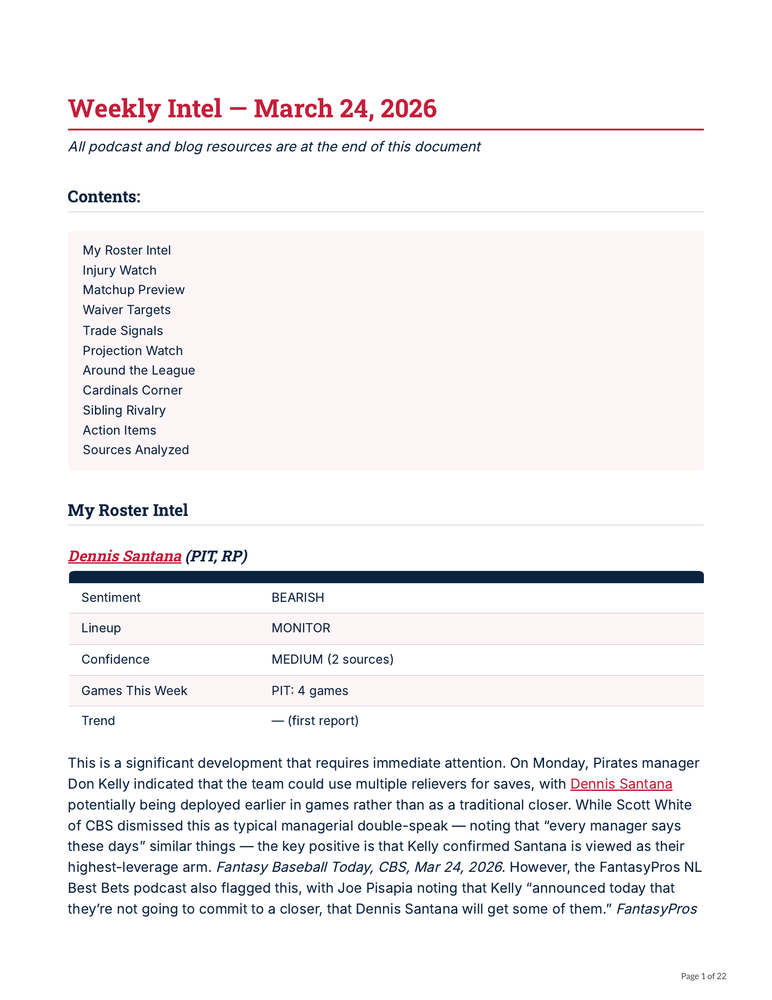
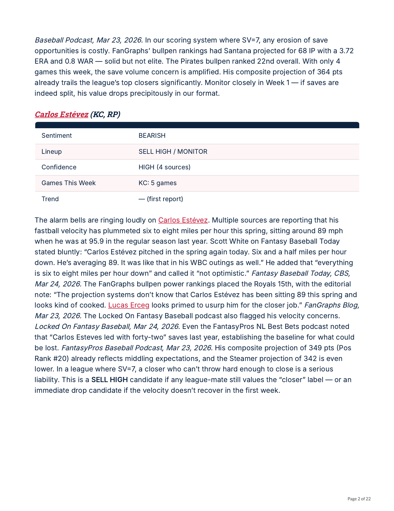
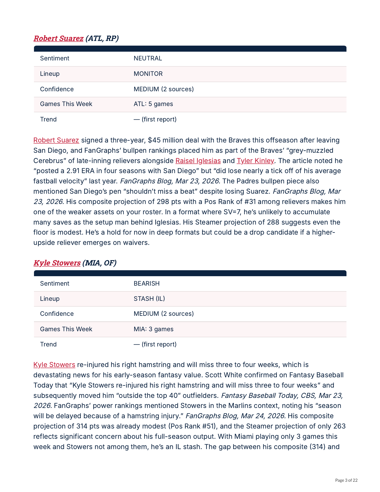

# Caught Stealing

A personal fantasy baseball analysis app built on the Yahoo Fantasy API. Blends Statcast data, consensus projections (Steamer/ZiPS/ATC), and AI-powered analysis into a single dashboard for roster optimization, trade evaluation, waiver recommendations, and weekly matchup breakdowns.

Built by **Brian Renshaw** with [Claude Code](https://claude.ai/claude-code).

---

## Documentation

### [App Manual](docs/APP_MANUAL.md)
How to use every feature in the app — dashboard, roster optimizer, trade analyzer, waiver wire, stats explorer, projections, matchups, and the AI assistant. Includes scoring breakdowns, stat definitions, and a full glossary.

### [Architecture](docs/ARCHITECTURE.md)
How the app is built — FastAPI services, SQLAlchemy models, ETL pipeline, projection blending, and the data flow from Yahoo/Statcast/FanGraphs into the database. Start here if you want to understand or extend the code.

### [AI Newsletter Pipeline](docs/AI_NEWSLETTER_PIPELINE.md)
The content ingestion system that pulls from fantasy baseball blogs and podcasts, then uses Claude to generate daily and weekly analysis reports with league-specific context. [See example newsletter below.](#ai-newsletter-example)

### [Changelog](CHANGELOG.md)

---

## Features

- **Dashboard** — League standings, weekly matchup projections, and roster overview
- **Roster Optimizer** — ILP-based daily/weekly lineup optimization (PuLP)
- **Trade Analyzer** — VORP + z-score trade values with side-by-side comparison
- **Waiver Wire** — Composite scoring with Steamer ROS projections and Statcast signals
- **Stats Explorer** — Interactive Plotly charts across batting, pitching, and Statcast metrics
- **Player Comparison** — Head-to-head stat comparison with radar charts
- **Projections** — Blended consensus projections with buy/sell signal detection
- **Intel Reports** — AI-generated daily analysis from ingested blogs and podcasts
- **AI Assistant** — In-app Claude-powered chat with league context
- **Matchup Quality** — Park factors, platoon splits, and opposing pitcher adjustments
- **Projection Accuracy** — Weekly tracking of projection accuracy vs actuals

## Tech Stack

| Layer | Tools |
|-------|-------|
| Backend | FastAPI, SQLAlchemy (async), APScheduler |
| Frontend | HTMX, Tailwind CSS, Plotly.js, Jinja2 |
| Database | SQLite via aiosqlite |
| Data | Yahoo Fantasy API (yfpy), pybaseball, MLB-StatsAPI |
| AI | Anthropic Claude API |
| Optimization | PuLP (Integer Linear Programming) |
| Deployment | Docker, Fly.io |

## Quick Start

1. **Install [uv](https://docs.astral.sh/uv/)**

2. **Configure environment**
   ```bash
   cp .env.example .env
   # Edit .env with your Yahoo API credentials and Anthropic API key
   ```

3. **Install dependencies and run**
   ```bash
   uv sync
   uv run uvicorn app.main:app --reload --port 8000
   ```

4. **First run** — The app will trigger a browser-based Yahoo OAuth flow. After authenticating, tokens refresh automatically.

> See the [App Manual](docs/APP_MANUAL.md) for a full walkthrough and the [Architecture](docs/ARCHITECTURE.md) guide for details.

## Development

```bash
uv run ruff check .                          # Lint
uv run ruff format .                         # Format
uv run pytest                                # Test
uv run python -m app.etl.pipeline            # Run ETL manually
uv run python -m scripts.daily_analysis      # Generate daily intel reports
```

## Project Structure

```
app/
  main.py              # FastAPI entry point + auth middleware
  config.py            # pydantic-settings configuration
  database.py          # SQLAlchemy async engine
  models/              # ORM models (players, stats, projections, rosters, etc.)
  services/            # Business logic (Yahoo, stats, trades, waivers, optimizer, AI)
  routes/              # FastAPI route handlers
  templates/           # Jinja2 HTML templates
  etl/                 # Data pipeline (extract, transform, load)
  static/              # CSS + JS (charts, tables, tooltips)
scripts/               # Backtesting, data pipeline, content ingestion
docs/                  # User guide, methodology, pipeline docs
tests/                 # pytest test suite
```

## AI Newsletter Example

The app's content pipeline ingests fantasy baseball podcasts and blog articles, then uses Claude to generate a personalized weekly intel report. Each report includes roster-specific analysis with sentiment ratings, lineup recommendations, injury alerts, trade signals, waiver targets, and league-contextualized advice — all citing the original sources.

[View the full 22-page PDF](docs/ai-newsletter-example.pdf)

<details>
<summary>Preview pages (click to expand)</summary>

<br>



<br><br>



<br><br>



</details>

## License

[MIT](LICENSE)
